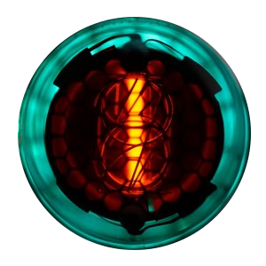

# InfoDome

[](http://www.youtube.com/watch?v=v8ImjMalxpY)

## Introduction

The InfoDome is an IoT project using an Arduino yùn to fetch and display remote information as well as temperature and RTC data through four [QS30-1](https://www.google.ch/search?q=QS30-1) nixie tubes.

A demo video can be found on .

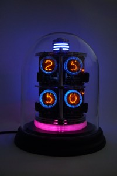
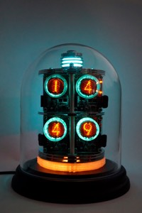
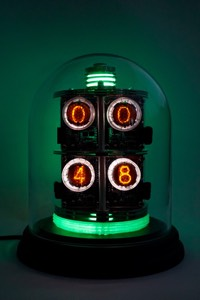
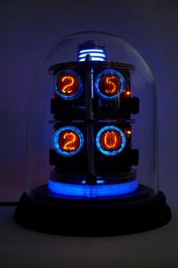

## Features

- 7 different modes
- Distance sensor detecting :hand: movements to manually switch between the modes
- RTC Clock
- Temperature / pressure module
- WiFi
- Updates RTC time via WiFi
- Fetch remote data via WiFi

## Modes

| Number | Mode | Format | Tube Color | Light Color |
|--------|------|--------|------------|-------------|
| 1 | Time | hh:mm | cyan | cyan, pulse |
| 2 | Date | mm.dd | orange | orange, pulse |
| 3 | Temperature | xx.xx' | blue | blue, pulse |
| 4 | Mail | xxxx | white | white |
| 5 | Git | xxxx | red | orange |
| 6 | Jira | xxxx | green | green |
| 7 | Cycling | - | - | rainbow |

## Configuration

The InfoDome needs to be connected to the local Wifi network. A full tutorial can be found on the official [guides page](https://www.arduino.cc/en/Guide/ArduinoYun#toc14).

Here's the short form:

 - Reset the wifi if joining a new network using the Wifi reset button:


- Press and hold for 5 seconds until the blue WLAN led starts blinking.
- In factory reset mode, the default IP address is _192.168.240.1_
- You can now connect to the WiFi network that appears with the SSID name "Linino-XXXXXXXXXXXX" (X = MAC address)
- Enter 192.168.240.1 or "http://linino.local" in a browser.

Note that restoring the WiFi configuration will cause the reboot of the linux environment.

### Temboo Account Data

In order to authenticate against Temboo you must download your custom TembooAccount.h header file from the Temboo website nd place it in the code directory.

The file contains three definitions:

```
#define TEMBOO_ACCOUNT ""
#define TEMBOO_APP_KEY_NAME ""
#define TEMBOO_APP_KEY ""
```

## Startup

The startup process takes a fair amount of time for the Yun to boot completely. During this time the dome lights are on but not animated.
After the dome is ready, it cycles through a short animation an loads the initial data, displaying 1010 while doing do. The looper mode will be set after completion.

## Operate

To switch between the modes place your hand near the infrared sensor. If the InfoDome detects it, it'll blink. The number of blinks also indicates the mode it's about to enter.

The "cycling" mode is a special mode where all other modes are automatically cycled. You can leave it by again placing your hand near the sensor.

The Dome will periodically fetch new information from Temboo. Sadly this is a blocking operation, in the meantime enjoy the digits :one::zero::one::zero:

## Other Functions

- Flash ambient light when mode changes - the number of flashes indicates the new mode
- Flash ambient light when an i2c module is malfunctioning
- Looper mode is indicated by the rainbow led on the bottom of the dome
- Data loading is indicated by the number "1010"
- Ambient light is pulsing in different modes

## Hardware

### Electronics
- [Arduino Yùn mini](http://www.arduino.org/products/boards/4-arduino-boards/arduino-yun-mini)
- 4x [A Fantastic Nixie Module for Arduino V2.0.0](http://www.play-zone.ch/en/elektronik-kit-zubehoer/avr-arduino-freeduino/zubehor/a-fantastic-nixie-module-for-arduino-arduino-compatible-v2-0-0.html)
- [Adafruit BMP085](https://www.adafruit.com/products/391) Temperature Sensor
- [Adafruit DS1307](https://www.adafruit.com/products/264) Real Time Clock
- [Sharp GP2Y0A21YK](https://www.sparkfun.com/products/242) Infrared Distance Sensor
- 3x [Ardafruit NeoPixel](https://www.adafruit.com/category/168)
- 1x Micro USB Breakout

### Other Parts

- Decorative glass tube from Interio
- Glass tube stand from Interio
- 3x old HDD
- Metal rods / screws
- 3d printed "Illuminators"

### Circuit diagram

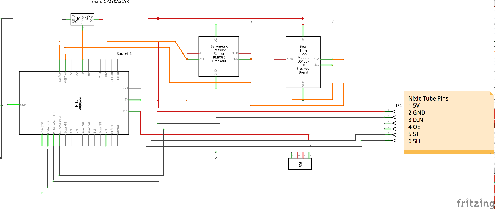

## Software

### Technical Architecture

The goal was to design a lightweight control system to operate the Dome sensors and peripherals. Because multiple operations should be done in parallel and independent of each other (read hand sensor, fade ambient lights) blocking the processor should be avoided at any cost.

The SMLib library helps to achieve this by turning the whole system into state machines which are able to execute periodically without blocking each other.

A different approach for a typical Arduino project was taken to keep the code flexible and fast.

State machines are handling data input and output. SMLib allows or _enforces_ a layered system where one machine controls the execution cycle of other machines.

Each machine serves different purposes with different execution times.

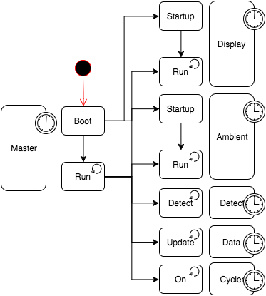

| Machine | Description |
|---------|-------------|
| Master | Executes all other state machines and handles the booting process. |
| Display | Display values on the nixie tubes based on the current mode |
| Ambient | Control the ambient leds based on the mode |
| Detect | Detect and debounce hand movements |
| Data | Download data via WiFi from Tembo |
| Looper | If turned on, cycle to a new mode after a specific interval until turned off |

### Timers

There are several timers used to control the time machine.
By adjusting them the base operation intervals can be altered.

| Name  | Description | Value |
|-------|-------------|-------|
| BOOT_TIMEOUT          | Timeout for booting animation | 5s |    
| TEMBOO_UPDATE_INTERVAL| Remote update interval | 15min |
| DETECTION_INTERVAL    | Distance sensor check interval (*2) | 300ms |     
| LOOPER_INTERVAL       | Looper mode timeout | 20s |
| PULSE_ON_NEW_VALUES_TIMEOUT | Tube pulse duration for new values | 4.2s |

### Online Data

The online data is aggregated using the "Choreo Editor" [Twyla](https://temboo.com/download/twyla) from the Arduino built-in IoT Stack [Temboo](https://temboo.com/).
Temboo is used in this project because it requires no additional
software in order to work - this is a good choice because the Arduino Yùn mini doesn't ship with an sd card reader, so we can't easily extend its very limited storage.

The editor takes some getting used to but is, all in all, quite easily understandable. Using the editor I've created a custom "choreo" or task which does these sequential tasks in order:

1. Fetch open merge requests from git server
2. Fetch open tickes from Atlassian Jira API
3. Fetch unread email from Google API
4. Fetch current local time for RTC adjustments

The great thing about the editor is that choreos are directly testable :smile:.

A run of this combined choreo returns:

```
    SUCCESSFUL COMPLETION:
    OUTPUT VARIABLES:

    currentTime = 19:02 16-01-03
    totalEmailCount = 45
    totalJiraTickets = 39
    totalMergeRequests = 1
```

This data can be fetched and parsed by the Arduino Temboo library.

### Libraries

- [SMLib](http://playground.arduino.cc/Code/SMlib)
- [RTCLib](https://github.com/adafruit/RTClib)
- [Adafruit BMP085](https://github.com/adafruit/Adafruit_BMP085_Unified)
- [Adafruit Sensor](https://github.com/adafruit/Adafruit_Sensor)
- Temboo (builtin)
- [NixieTube](http://www.nixieclock.org/?p=541)

# Caveats

The biggest obstacle in this project by far is the extremely limited program storage. With only 28,672 bytes (or 0.001 kbytes) the options are limited and minimal sized code is key.
The source code is currently occupying 99% program storage.
Imagine what could be done with even more space!

Because the temperature sensor is placed inside the dome, it'll read the inner temperature which will be a little over the current room temperature. We could compensate for this but it's a nice way of surveying the Dome itself.

# Closing Thoughts

As always, there are still some things left to be done... But I'm quite happy how this project turned out.

You could technically fetch and display any data you'd like to as long as it's accessible via (auhtenticated) APIs. Temboo also has a free plan with enough requests to test the choreos.

If you're an experienced :snake: (Python) programmer, there might be the option to shift the bulk of the code to the linux distribution and turn the Arduino into peripheral just displaying information.
Check the Arduino Yùn Tutorials for more information.

# Some pictures


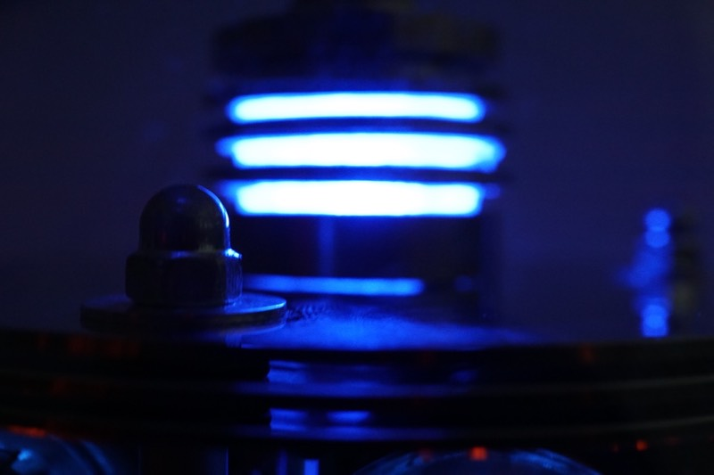

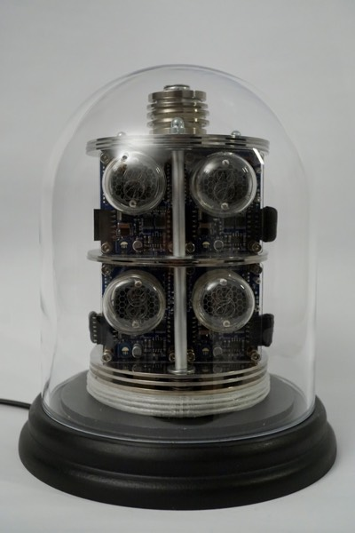

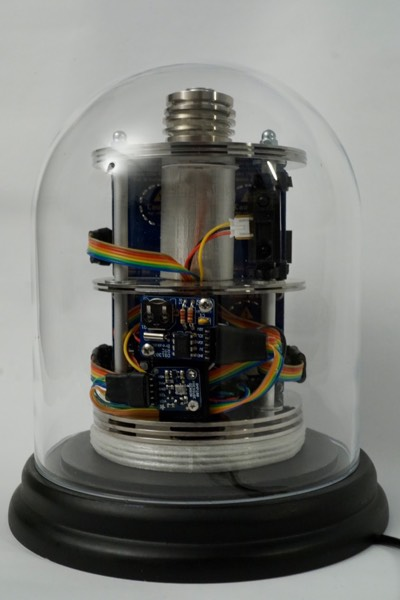

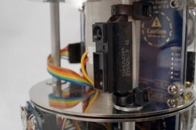
